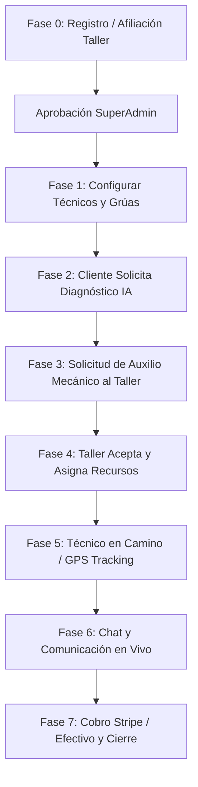

# 📐 Arquitectura, Estructura y Flujo del Backend

Este documento detalla en profundidad el diseño arquitectónico, la estructura de directorios, el modelo de datos de la base de datos y el flujo completo de extremo a extremo (E2E) del backend de la plataforma de **Auxilio Mecánico y Diagnóstico Asistido por Inteligencia Artificial**.

---

## 📂 1. Estructura del Proyecto (Arquitectura de Capas)

El backend está desarrollado sobre **FastAPI** en Python, siguiendo una arquitectura limpia y modular dividida por capas de responsabilidad para facilitar el mantenimiento y la escalabilidad.

```
BACKEND-repo/
│
├── alembic/                      # Gestión de versiones y migraciones de Base de Datos
│   └── versions/                 # Scripts incrementales de SQL/SQLAlchemy
│
├── app/                          # Código principal de la aplicación
│   ├── main.py                   # Punto de entrada, configuración de middleware (CORS, Estáticos) y enrutador
│   │
│   ├── api/                      # Capa de presentación y enrutamiento (HTTP Endpoints)
│   │   └── api_v1/
│   │       ├── endpoints/        # Módulos controladores por recurso (auth, vehículos, servicios, etc.)
│   │       └── routers.py        # Centralizador y prefijador de rutas de la versión 1
│   │
│   ├── core/                     # Configuraciones transversales del sistema
│   │   ├── config.py             # Carga y validación de variables de entorno (.env)
│   │   └── exceptions.py         # Manejadores de errores personalizados HTTP
│   │
│   ├── crud/                     # Capa de acceso directo a datos (Create, Read, Update, Delete)
│   │   ├── base.py               # Clase genérica CRUDBase con operaciones SQL estándar
│   │   └── crud_*.py             # Extensiones particulares de consultas SQL para cada tabla
│   │
│   ├── db/                       # Capa de conexión a la base de datos
│   │   ├── base_class.py         # Declaración de la clase Base de SQLAlchemy
│   │   ├── base.py               # Punto de unión de todos los modelos SQLAlchemy para Alembic
│   │   └── session.py            # Fábrica de sesiones asíncronas (AsyncSession) para PostgreSQL
│   │
│   ├── schemas/                  # Capa de validación y tipado de datos (Pydantic Models)
│   │   └── *.py                  # Definición de payloads de entrada y esquemas de respuesta JSON
│   │
│   └── services/                 # Capa de lógica de negocio (Núcleo funcional)
│       ├── auth_service.py       # Flujos de sesión, hashes de contraseñas y creación de JWT
│       ├── diagnostico_service.py# Lógica del diagnóstico con IA (integración con Groq API / Whisper)
│       ├── notification_service.py# Envío de notificaciones push móviles mediante Firebase (FCM)
│       ├── otp_service.py        # Generación, validación y expiración temporal de códigos OTP de 6 dígitos
│       ├── pago_service.py       # Integración transaccional con la pasarela Stripe
│       └── servicio_service.py   # Reglas de asignación y disponibilidad de recursos de taller
│
├── requirements.txt              # Definición de dependencias de Python
└── .env.example                  # Plantilla de variables de entorno requeridas
```

---

## 🗄️ 2. Modelo y Relaciones de Base de Datos

La base de datos utiliza **PostgreSQL** potenciado con **PostGIS (GeoAlchemy2)** para gestionar coordenadas geográficas (puntos geográficos en formato SRID 4326) que permiten calcular distancias en tiempo real entre conductores y talleres.

### Relaciones Clave del Modelo de Datos:
1. **Persona & Usuario**: Una `persona` almacena datos civiles (CI, dirección, teléfono). Un `usuario` está vinculado de forma única (`1:1`) a una persona y contiene las credenciales de autenticación.
2. **Rol & Permiso**: Relación de muchos a muchos (`N:M`) representada en la tabla pivote `rol_permiso` para controlar privilegios en el portal web (SuperAdmin, Administrador Taller) y en la aplicación móvil (Conductor, Técnico).
3. **Solicitud de Afiliación & Taller**: Un usuario normal puede solicitar registrar su taller. Tras ser evaluada por un Superadministrador, la `solicitud_afiliacion` se aprueba y se inserta automáticamente un registro en la tabla `taller`, promoviendo al usuario a `administrador_taller` para ese ID.
4. **Recursos del Taller**:
   - `empleado`: Vincula a un usuario con un taller, con roles específicos como técnicos.
   - `vehiculo_taller`: Flotilla del taller (grúas de remolque, camionetas de asistencia rápida).
5. **Diagnóstico IA**:
   - `solicitud_diagnostico`: Creada por el conductor, contiene la descripción, coordenadas GPS del incidente y los archivos adjuntos (`evidencia`, ya sean audios o fotos).
   - `diagnostico`: Resultados generados por la IA (Groq LLM/Whisper), estimando el nivel de confianza y asociando uno o más `incidente` del catálogo de `tipo_incidente`.
6. **Servicio y Asignación**:
   - Al aceptarse una solicitud de auxilio, se crea un `servicio` activo.
   - El taller asigna recursos mediante las tablas asociativas `servicio_tecnico` y `servicio_vehiculo` (soporta múltiples técnicos y grúas asignadas a un solo servicio).
7. **Monitoreo & Chat**:
   - Cada servicio registra coordenadas periódicas en `empleado_ubicacion` para rastrear la grúa en tiempo real.
   - `mensaje`: Almacena el chat en vivo asociado al servicio.
8. **Pagos**:
   - La tabla `factura` (o registros de pagos) rastrea las transacciones con Stripe (enlace digital de checkout) o el cobro en efectivo.

---

## 🔄 3. Flujo Completo del Sistema (Ciclo de Vida E2E)

El flujo de trabajo del sistema está estructurado en **7 fases secuenciales** que conectan al Cliente, al Administrador del Taller, al Técnico asignado y al Superadministrador:



### 🔹 Fase 0: Afiliación de Talleres
1. Un usuario se registra en la web e inicia una solicitud de afiliación (`POST /solicitudes/afiliacion/`), aportando datos de contacto y la ubicación geográfica de su negocio.
2. Un Superadministrador evalúa las solicitudes pendientes, aprobándola mediante `PUT /solicitudes/afiliacion/{id}/estado`.
3. El sistema crea el registro del **Taller**, crea el rol del usuario como **Administrador de Taller** y lo asocia a dicha sucursal.

### 🔹 Fase 1: Configuración de Recursos
1. El Administrador del Taller inicia sesión y registra su flota de vehículos de asistencia (`POST /talleres/{id}/vehiculos/`), clasificándolos como `remolque` (grúa) o `servicio` (auxilio rápido).
2. Registra e invita a sus técnicos (`POST /talleres/{id}/tecnicos/`), asociando las especialidades del técnico (ej. mecánica general, electricidad automotriz).

### 🔹 Fase 2: Diagnóstico Inteligente (Cliente)
1. Un conductor varado en la calle describe su problema y opcionalmente graba un audio de la falla o toma fotos del motor.
2. Envía los datos mediante `POST /diagnosticos/solicitar`.
3. **Procesamiento de IA (Groq)**:
   - Si se adjuntó audio, el backend invoca a **Whisper** de forma asíncrona para transcribir la voz del conductor.
   - El texto transcrito o escrito alimenta un prompt optimizado enviado a **Groq (Llama 3.1 8B)**.
   - La IA clasifica el tipo de falla, evalúa la gravedad y determina con qué probabilidad (nivel de confianza) pertenece a las categorías e incidentes registrados.
4. El backend responde con el diagnóstico estructurado listo para que el usuario tome una decisión.

### 🔹 Fase 3: Solicitud de Servicio
1. El cliente, habiendo recibido el diagnóstico oficial, presiona un botón para solicitar ayuda a un taller específico.
2. Esto ejecuta `POST /servicios/{diagnostico_id}/solicitar-taller`, enviando la solicitud directamente a la bandeja del taller.

### 🔹 Fase 4: Despacho y Creación de Servicio (Taller)
1. El Administrador de Taller monitorea las solicitudes entrantes en tiempo real (`GET /taller/solicitudes/recientes`).
2. Al revisar la solicitud, el sistema le sugiere técnicos disponibles que cuenten con la especialidad requerida para el incidente.
3. El administrador acepta la solicitud (`POST /taller/solicitudes/{id}/aceptar`), seleccionando y bloqueando al técnico y la grúa que asistirán al conductor.
4. El estado del técnico y el vehículo cambia automáticamente a `en_servicio`, impidiendo que sean asignados a otras emergencias en paralelo.

### 🔹 Fase 5: Tracking GPS en Tiempo Real
1. El técnico asignado recibe la notificación en su aplicación móvil, abre el servicio y cambia el estado a "En Camino" (`PUT /tecnico/servicios/{id}/actualizar-estado`).
2. El dispositivo móvil del técnico transmite su ubicación geográfica en intervalos regulares (`POST /tecnico/servicios/{id}/actualizar-ubicacion`).
3. El cliente, desde su app, consume un endpoint (`GET /monitoreo/servicio/{id}/ubicacion-tecnico`) para ver en tiempo real la ruta de la grúa sobre el mapa y el tiempo de llegada estimado (ETA).

### 🔹 Fase 6: Chat de Emergencia
* Cliente y técnico se comunican mediante un chat dedicado al servicio (`POST /mensajes/servicio/{id}`). Esto evita que el técnico se distraiga y centraliza toda la auditoría de comunicación de la asistencia mecánica.

### 🔹 Fase 7: Facturación y Cierre de Servicio
1. Una vez que el técnico soluciona el problema o remolca el vehículo, genera la orden de cobro (`POST /pagos/servicio/{id}/generar` para Stripe o `pago-efectivo`).
2. Si es por **Stripe**, el backend interactúa con la API de Stripe para generar una sesión de Checkout. El cliente realiza el pago digital con su tarjeta y Stripe notifica la confirmación.
3. Al registrarse el pago, el servicio cambia a estado `completado`/`finalizado`, y **automáticamente libera los recursos**: el técnico y la grúa vuelven al estado de `disponible`, listos para una nueva emergencia.

---

## 💻 4. Cómo levantar el Backend Localmente

### 🎛️ Requisitos Previos
- Python 3.10 o superior instalado.
- Base de datos **PostgreSQL** activa con la extensión **PostGIS** habilitada.
- Archivo `.env` configurado con las variables correspondientes (revisa `.env.example`).

### ⚙️ Instalación Rápida

1. **Activar el Entorno Virtual**:
   ```bash
   # En Windows:
   venv\Scripts\activate
   
   # En Linux / macOS:
   source venv/bin/activate
   ```

2. **Instalar dependencias**:
   ```bash
   pip install -r requirements.txt
   ```

3. **Ejecutar Migraciones de Base de Datos (Alembic)**:
   ```bash
   alembic upgrade head
   ```

4. **Llenar la Base de Datos con Semillas Básicas (Opcional)**:
   Puedes correr los scripts de semilla provistos en la raíz del proyecto para poblar catálogos e incidentes:
   ```bash
   python seed_especialidades.py
   python seed_tipos_incidente.py
   ```

5. **Iniciar el Servidor**:
   ```bash
   uvicorn app.main:app --reload
   ```

6. **Explorar e Interactuar (Swagger UI)**:
   Abre en tu navegador la dirección interactiva del API:
   👉 **[http://localhost:8000/docs](http://localhost:8000/docs)** o **[http://localhost:8000/redoc](http://localhost:8000/redoc)**

---

## 🎯 5. Uso de la Colección de Postman

Hemos creado un archivo de colección listo para importar: `postman_collection.json` en la raíz del proyecto.

### Pasos para usarla:
1. Abre tu aplicación **Postman**.
2. Haz clic en **Import** (esquina superior izquierda).
3. Selecciona o arrastra el archivo `postman_collection.json` generado.
4. Selecciona la pestaña **Variables** de la colección importada para ajustar el `baseUrl` si es diferente (por defecto es `http://localhost:8000`).
5. **Autenticación Simplificada**: La colección cuenta con un script de prueba (Test Script) en el endpoint **Web Login** y **Verify OTP**. Al ejecutarse con éxito, estos requests extraen el Token JWT de la respuesta y actualizan automáticamente la variable de colección `{{token}}`. Los demás endpoints heredan esta autenticación de forma transparente.
6. ¡Prueba los endpoints en orden (del 0 al 9) para completar el ciclo de vida del servicio sin complicaciones!
